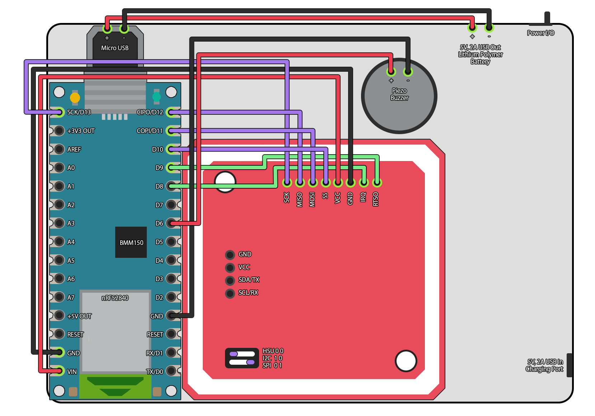

## 
 Companion PLUS! - An Extended Reality game for you and your pet 

## Game Guide
### Introduction
Thank you for your interest in the Companion PLUS! project! This document serves to explain how to use the application and device, as well as how to build your own.

Companion PLUS! is an application for Android 12 onwards mobile phones, to be used with a specially formatted NFC game card and peripheral device. The most recent build of the application (CompanionPLUS.apk) can be downloaded from this repository directly to a mobile phone and installed.

### Features
+ Tracking pet's steps along walks and storing as experience points to 'level' them up in-game
+ Contactless game data transfer between mobile phone application and peripheral device via game card
+ Low-powered and lightweight microcontroller-based device that allows for prolonged use on pet collar with minimal maintanance
+ Models designed for 3D printing in PLA, an eco-friendly and biodegradable plastic material
+ Open-source and easy to modify project files, using Adafruit's PN532 library for Arduino

### Setup
#### Application
+ Download the application from the root of the repository files
+ Locate in your Android mobile phone's downloaded files and install
+ Ensure your phone's NFC capabilities are enabled (Android Settings) 
+ Open the application for the first time and name your pet's virtual avatar
+ Transfer game data from the device to your mobile phone using the game card
+ Application can only read game card once per day
#### Device
+ Check the device is sufficiently charged before use
+ Remove pet's collar and loop through the device's strap
+ Turn on device via power button when taking pet on walks, tone will be heard
+ Turn off device by holding down the power button until LED turns off
+ To transfer game data, use device and hold game card over device until tone is heard
+ Turning off the device resets all game data held by the device!

### Warnings 
+ Not suitable for small pets - please try device on pet indoors and gauge their comfort before further use
+ Peripheral device casing designs for use only with dog collars
+ Be sure the device is fitted to the pet's collar securely
+ Do not operate the device near bodies of water or during rainfall
+ Do not submerge the device in water
+ Only open casing if device is powered off
+ If the owner or pet appear ill or other adverse effects occur, stop using device/application
+ Do not use device/application while pet is injured

## Technical Information
### Information on peripheral device libraries and hardware
This project includes an Arduino library to use NFC technology with a PN532 module, including [Don's NDEF Library](http://goo.gl/jDjsXl). It is based on 
[Adafruit_NFCShield_I2C](http://goo.gl/pk3FdB), improved by [Seeed Studio](http://goo.gl/zh1iQh), added HSU(High Speed Uart) driver by [Elechouse](http://elechouse.com), functionality for Nano 33 BLE boards by [liswifi](https://twitter.com/liswifi).

### Supported PN532 modules
+ [Elechouse NFC Module](http://goo.gl/i0EQgd)
+ [Seeed Studio NFC Shield](http://goo.gl/Cac2OH)
+ [Xadow NFC](http://goo.gl/qBZMt0)
+ [Adafruit PN532 NFC/RFID controller breakout board](http://goo.gl/tby9Sw)

### Features
+ IMU data to NDEF record payload conversion
+ Support all interfaces of PN532 (I2C, SPI, HSU)
+ Read/write Mifare Classic Card
+ Support Peer-to-Peer communication(exchange data with android 4.0+)
+ Support [mbed platform](http://goo.gl/kGPovZ)
+ Support Arduino Nano 33 BLE
+ Game application support for reading NDEF record payload
+ Game manager with Save/Load features to easily store game data

### Getting Started
1. Download [zip file](https://github.com/nestrd/Companion-PLUS/archive/refs/heads/main.zip) and 
extract the libraries(NDEF, PN532, PN532_SPI, PN532_HSU and PN532_I2C, PN532_SWHSU) into libraries directory of Arduino IDE.
2. Open the Unity project in Unity 2021 LTS onwards to gain access to all game application project files.
3. Assemble peripheral device as per the below schematics and secure in 3D printed casing.
4. Connect Arduino Nano 33 BLE Sense Rev2 (microprocessor) to computer via USB and open Arduino IDE.
5. Compile and upload code to microprocessor, seal peripheral device casing.
6. Secure peripheral device onto pet collar and switch on or off as required (see Warnings section in Game Guide above).

### Schematics for peripheral device
+  VIN <-> VCC
+  GND <-> GND
+  SCK <-> SCK
+  D12 <-> MISO
+  D11 <-> MOSI
+  D10 <-> SS
+   D9 <-> RTSO
+   D6 <-> Piezo buzzer
+ VUSB <-> 5V, 2A USB power

### Other resources
+ [Arduino Nano 33 BLE Sense Rev2](https://docs.arduino.cc/hardware/nano-33-ble-sense-rev2)
+ [Mega](http://arduino.cc/en/Main/arduinoBoardMega)
+ [DUE](http://arduino.cc/en/Main/arduinoBoardDue)
+ [Leonardo](http://arduino.cc/en/Main/arduinoBoardLeonardo)
+ [SoftwareSerial](https://www.arduino.cc/en/Reference/softwareSerial)
+ [Adafruit PN532 library](https://github.com/adafruit/Adafruit-PN532)
+ [elechouse PN532 library](https://github.com/elechouse/PN532)
